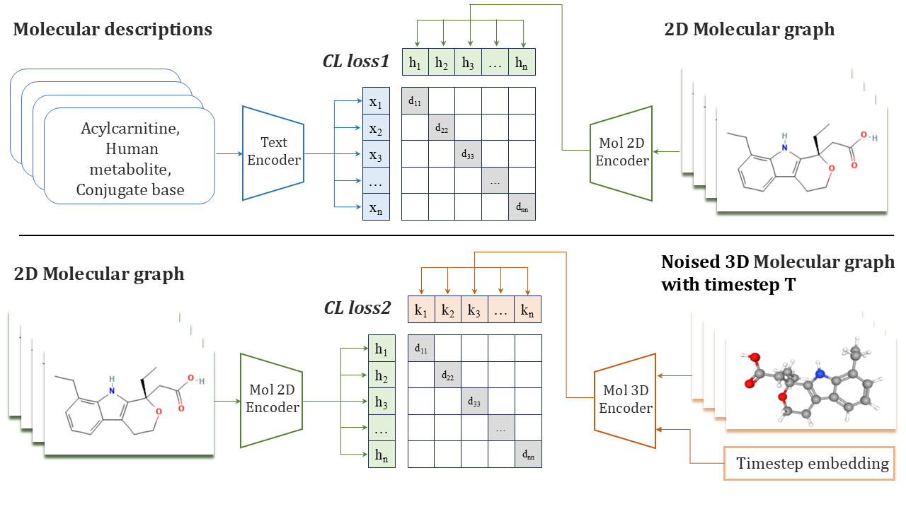

# TDmol
Source code for the paper:  **Three dimensional molecule design: a novel textual description-conditional multimodal equivariant diffusion algorithm**

## Overview
Generating novel and functional molecules is an essential and challenging task in drug discovery. Three dimensional (3D) structure design can directly reflect a molecule’s biological function, while its complexity and topology irregularity make de novo 3D molecule generation highly difficult as the possible space is too huge. Conditional design is a promising solution for this challenging task in a more accurate and quick manner. The textual description of a molecule contains useful structural and functional information, making it much useful to guide 3D molecule generation. In this study, we propose a text-guided de novo 3D molecule generation approach TDmol based on the diffusion model and pretrained language model. To precisely reveal the hidden relationship across different modalities of molecular textual description, 2D and 3D structures, TDmol designs a new two-stage modality alignment contrastive deep learning pipeline to extract the cross-modality shared knowledge and unique feature as the condition in the generation step. To the best of our knowledge, TDmol is the first to realize text-3D modality alignment to conditional molecule generation.


## Dependency

- python 3.8
- torch 1.11.0
- transformers 4.22.2

## Pipeline
1. Training text-3D alignment model:
   ```bash
   python finetune_CL.py 
   ```

3. Sampling 3D molecules with given text prompt
   ```bash
   python sample.py 
   ```

## LISENCE
- All materials are made available under the terms of the Creative Commons Attribution-NonCommercial 4.0 International Public License (CC BY-NC 4.0) license. You can find details at: [https://creativecommons.org/licenses/by-nc/4.0/legalcode](https://creativecommons.org/licenses/by-nc/4.0/legalcode)
- The license gives permission for academic use only.

## Contact

- [fy826943194@sjtu.edu.cn](mailto:fy826943194@sjtu.edu.cn)
